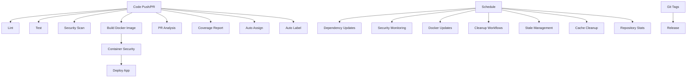

# 🚀 CI/CD Pipeline Documentation

This document explains the complete CI/CD setup for the NestJS application using GitHub Actions.

## 📋 Overview

The CI/CD pipeline follows the **Single Responsibility Principle** with focused, single-purpose workflows that handle specific aspects of the development lifecycle. Each workflow has a clear, single responsibility making them easier to maintain, debug, and understand.

## 🔄 Workflow Architecture

### 🧪 **Code Quality & Testing Workflows**

#### 1. **Lint** (`lint.yml`)
- **Purpose**: Code quality and formatting checks
- **Triggers**: Push/PR to main branches
- **Responsibilities**: ESLint, Prettier formatting
- **Outputs**: Lint results artifact

#### 2. **Test** (`test.yml`)  
- **Purpose**: Unit and E2E testing with coverage
- **Triggers**: Push/PR to main branches
- **Services**: PostgreSQL, Redis
- **Outputs**: Coverage reports, test artifacts

#### 3. **Security Scan** (`security.yml`)
- **Purpose**: Code security analysis
- **Triggers**: Push/PR to main branches, daily schedule
- **Responsibilities**: Dependency audit, CodeQL analysis
- **Outputs**: Security reports

### 🐳 **Build & Deployment Workflows**

#### 4. **Build Docker Image** (`build.yml`)
- **Purpose**: Docker image building and registry publishing
- **Triggers**: Push to main, tags, PRs
- **Outputs**: Multi-platform Docker images (amd64, arm64)

#### 5. **Container Security** (`container-security.yml`)
- **Purpose**: Docker image vulnerability scanning
- **Triggers**: After successful builds, daily schedule
- **Tools**: Trivy scanner
- **Outputs**: SARIF security reports

#### 6. **Deploy App** (`deploy-app.yml`)
- **Purpose**: Application deployment to environments
- **Triggers**: After successful builds and security scans
- **Environments**: Staging, Production
- **Features**: Smoke tests, deployment verification

#### 7. **Release** (`release.yml`)
- **Purpose**: GitHub release creation
- **Triggers**: Git tags, manual dispatch
- **Features**: Changelog generation, Docker image references

### 📊 **Pull Request Workflows**

#### 8. **PR Analysis** (`pr-analysis.yml`)
- **Purpose**: Pull request size and complexity analysis
- **Features**: Size labeling, change statistics
- **Outputs**: PR analysis comments

#### 9. **Coverage Report** (`coverage.yml`)
- **Purpose**: Test coverage reporting for PRs
- **Features**: Coverage comments, quality gates
- **Integration**: Codecov, coverage artifacts

#### 10. **Auto Assign** (`auto-assign.yml`)
- **Purpose**: Intelligent reviewer and assignee assignment
- **Features**: File-based assignment, expertise matching

### 🏷️ **Automation Workflows**

#### 11. **Auto Label** (`auto-label.yml`)
- **Purpose**: Automatic labeling of issues and PRs
- **Features**: File-based labeling, content analysis

### 📦 **Maintenance Workflows**

#### 12. **Dependency Updates** (`dependency-updates.yml`)
- **Purpose**: Automated dependency updates
- **Schedule**: Weekly (Mondays)
- **Features**: Update testing, automated PRs

#### 13. **Security Monitoring** (`security-monitoring.yml`)
- **Purpose**: Continuous security monitoring
- **Schedule**: Daily
- **Features**: Vulnerability detection, issue creation

#### 14. **Docker Updates** (`docker-updates.yml`)
- **Purpose**: Docker base image update tracking
- **Schedule**: Weekly (Sundays)
- **Features**: Version tracking, update reminders

### 🧹 **Cleanup Workflows**

#### 15. **Cleanup Workflows** (`cleanup-workflows.yml`)
- **Purpose**: Old workflow run cleanup
- **Schedule**: Daily
- **Retention**: 30 days

#### 16. **Stale Issues & PRs** (`stale.yml`)
- **Purpose**: Stale content management
- **Schedule**: Daily
- **Rules**: 30 days to stale, 7 days to close

#### 17. **Cache Cleanup** (`cache-cleanup.yml`)
- **Purpose**: GitHub Actions cache management
- **Schedule**: Weekly
- **Features**: Old cache cleanup, PR cache cleanup

#### 18. **Repository Stats** (`repository-stats.yml`)
- **Purpose**: Repository statistics generation
- **Schedule**: Weekly
- **Features**: Activity tracking, contribution metrics

## 🔗 Workflow Dependencies



## 🛠️ Setup Instructions

### 1. Repository Secrets

Configure the following secrets in your GitHub repository:

```yaml
# Required for deployments
GITHUB_TOKEN: # Automatically provided by GitHub

# Optional: For enhanced notifications
SLACK_WEBHOOK_URL: # For Slack notifications
DISCORD_WEBHOOK_URL: # For Discord notifications
```

### 2. Environment Configuration

Create deployment environments in your repository settings:

- **staging**: For staging deployments
- **production**: For production deployments (with protection rules)

### 3. Branch Protection Rules

Configure branch protection for `main`/`master`:

```yaml
Required checks:
  - 🔍 ESLint & Prettier
  - 🧪 Unit & E2E Tests  
  - 🔒 Dependency Security Scan
  - 🔍 CodeQL Analysis
  - 🐳 Build & Push Docker Image

Settings:
  - Require pull request reviews
  - Dismiss stale reviews
  - Require status checks to pass
  - Require up-to-date branches
  - Restrict pushes to matching branches
```

## 📊 Benefits of Single-Purpose Workflows

### ✅ **Advantages**

1. **🔍 Clarity**: Each workflow has a single, clear purpose
2. **🐛 Debugging**: Easier to identify and fix issues
3. **⚡ Performance**: Parallel execution of independent tasks
4. **� Reusability**: Workflows can be reused and referenced
5. **🎯 Focused Logs**: Cleaner, more focused log output
6. **🛠️ Maintenance**: Easier to update and modify individual workflows
7. **📈 Scalability**: Add new workflows without affecting existing ones
8. **🚀 Speed**: Faster feedback with targeted workflows

### 📋 **Workflow Responsibilities**

| Workflow | Single Responsibility |
|----------|----------------------|
| `lint.yml` | Code quality and formatting |
| `test.yml` | Testing and coverage |
| `security.yml` | Code security analysis |
| `build.yml` | Docker image building |
| `container-security.yml` | Container vulnerability scanning |
| `deploy-app.yml` | Application deployment |
| `release.yml` | Release management |
| `pr-analysis.yml` | Pull request analysis |
| `coverage.yml` | Coverage reporting |
| `auto-assign.yml` | Assignment automation |
| `auto-label.yml` | Labeling automation |
| `dependency-updates.yml` | Dependency management |
| `security-monitoring.yml` | Security monitoring |
| `docker-updates.yml` | Docker image tracking |
| `cleanup-workflows.yml` | Workflow cleanup |
| `stale.yml` | Stale content management |
| `cache-cleanup.yml` | Cache management |
| `repository-stats.yml` | Statistics generation |

## 🚀 Usage Examples

### Running Individual Workflows

```bash
# Trigger security scan manually
gh workflow run security.yml

# Trigger dependency updates
gh workflow run dependency-updates.yml

# Trigger deployment to staging
gh workflow run deploy-app.yml -f environment=staging
```

### Monitoring Workflow Status

```bash
# List all workflow runs
gh run list

# View specific workflow runs
gh run list --workflow=lint.yml

# View workflow details
gh run view <run-id>
```

## 🎯 Best Practices Implemented

1. **Single Responsibility**: Each workflow does one thing well
2. **Fail Fast**: Quick feedback with focused checks
3. **Parallel Execution**: Independent workflows run simultaneously
4. **Caching**: Efficient dependency and build caching
5. **Security First**: Multiple security scanning layers
6. **Automation**: Minimal manual intervention required
7. **Monitoring**: Comprehensive monitoring and alerting
8. **Documentation**: Clear, comprehensive documentation

## 🔧 Customization Guide

### Adding New Workflows

1. Create a new workflow file in `.github/workflows/`
2. Follow single responsibility principle
3. Add appropriate triggers
4. Include error handling
5. Add documentation

### Modifying Existing Workflows

1. Update only the specific workflow needed
2. Test changes in a feature branch
3. Monitor workflow execution
4. Update documentation as needed

### Environment-Specific Configuration

Each deployment environment can have specific settings:

```yaml
# Staging environment
env:
  NODE_ENV: staging
  LOG_LEVEL: debug
  RATE_LIMIT: 100

# Production environment  
env:
  NODE_ENV: production
  LOG_LEVEL: warn
  RATE_LIMIT: 1000
```

## 📈 Monitoring & Metrics

### Key Performance Indicators

- **Build Success Rate**: % of successful builds
- **Deployment Frequency**: Deployments per week
- **Lead Time**: Code commit to production time
- **Recovery Time**: Time to fix failed deployments
- **Security Issues**: Number of vulnerabilities found/fixed

### Available Dashboards

1. **GitHub Actions**: Built-in workflow monitoring
2. **Security**: Security advisories and scans
3. **Dependencies**: Dependency graph and updates
4. **Repository Stats**: Weekly activity reports

---

**🎉 Your CI/CD pipeline is now properly organized with single-purpose workflows!**

Each workflow has a clear responsibility, making the entire system more maintainable, debuggable, and scalable.